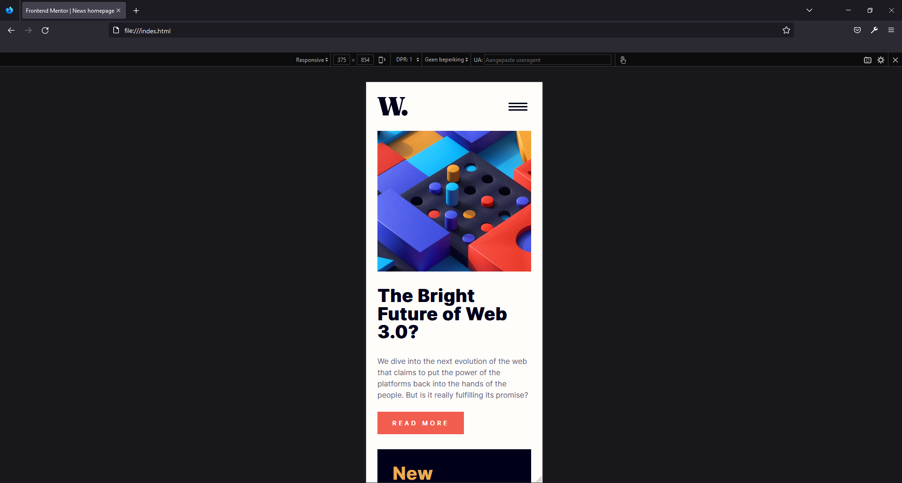

# D-Media assigment - Mark van Dam

This is a solution to the [News homepage challenge on Frontend Mentor](https://www.frontendmentor.io/challenges/news-homepage-H6SWTa1MFl).

# Result

## My process

### Built details

- Semantic HTML5 markup
- CSS via SASS (SCSS)
- CUBE styling Method
- Mobile-first workflow (except menu)
- Javascript for mobile menu-animation

Not:
- Aria-controls settings
- Atomic design

### What I learned

- Best is to first set up your root and all your utilities. Then create your HTML and connect your utilities to the elements. In this way when you start styling, you already have the right view on you elements.
- Some extra scss skills
- Never automatically trust your 'live sass/scss compilator in Code Studio 😜' 

### Useful resources

- [Example resource 1](https://www.linkedin.com/in/renekrewinkel/) - Rene Krewinkel: A-Z Frontend Guru
- [Example resource 2](https://www.kevinpowell.co/) - Kevin Powell: CSS guru

## Author

- Website - [Mark van Dam](https://www.linkedin.com/in/mark-van-dam-37a13325/)